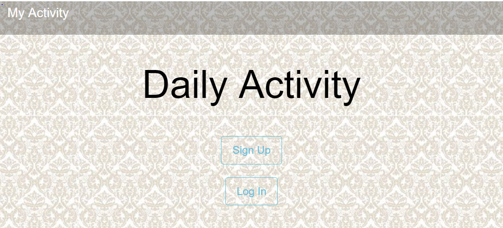
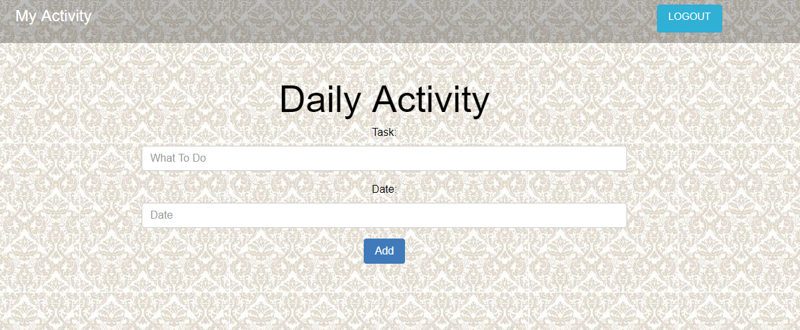

# Tugas-To-Do-List-NodeJS
Tugas Kelompok

* Berikut adalah aplikasi __To-Do-List__ dengan menggunakan platform __NodeJS__, __template engine pug__, dan __data base Mongo__. Tujuan dari aplikasi ini adalah untuk menambahkan dan menampilkan list yang telat di inputkan oleh user terlebih dahulu.

* port yang digunakan untuk _Server_ yaitu http://127.0.0.1:3000

* port yang digunakan untuk _User_ atau _Client_ yaitu http://127.0.0.1:3001

* Berikut adalah tampilan awal atau halaman index
  
  

* Sebelum menjalankan aplikasi ini user harus terlebih dahulu `Sign Up` di form yang telah tersedia.

* Setelah mengklik `Sign Up` maka user akan diminta untuk mengisi form sebagai berikut:
  
  


* Setelah `Sign Up` user akan di redirect ke halaman `Log In` dan user diminta kembali untuk mengisi form seperti berikut:
  
  

* Pada halaman `Log In` tersebut aplikasi akan memanggil database username dan password menggunakan JQuery-Ajax, lalu meresponnya dengan melakukan redirect ke halaman Profile. Berikut block-code JQuery-Ajax yang digunakan untuk meneruskan ke halaman Profile :
  ```js
  function redirect(userdata){
			$.ajax({
					type: 'POST',
					url: 'http://127.0.0.1:3001/profile',
					data: userdata,
					success: function(newData){
						console.log(userdata);
						
					},
					error: function(){
						alert('gagal kedua');
					}
			});
			window.location.replace("http://127.0.0.1:3001/profile");
		};
    ```


* Berikut adalah tampilah halaman Profile
  
  


* User dapat menginput To-Do-List sesuai yang diinginkan dengan menuliskan di *Task* dan *Date* yang disediakan
  
  


* To-Do-List yang telah di inputkan akan di tampilkan kembali dihalaman tersebut
  
  
  
 * Jika _User_ telah selesai makan _user_ dapat keluar dari aplikasi dengan mengklik tombol `Logout` di pojok kanan atas.


